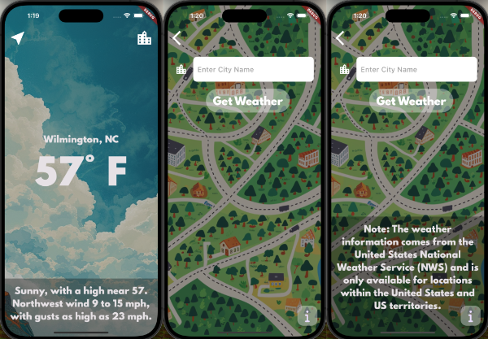

# weather_app

  

A tiny weather app that reads data from the United States National Weather Service API and uses the phone's location to display the current temperature and current description of the weather. The background image in the main weather screen changes depending on the weather conditions. A second screen is available to allow the user to enter a location. On the second screen, there is an "info" button that, if clicked, will pull up a modal screen from the bottom. This modal screen just explains that the weather data is from NWS and is only going to work in the United States and US territories.

